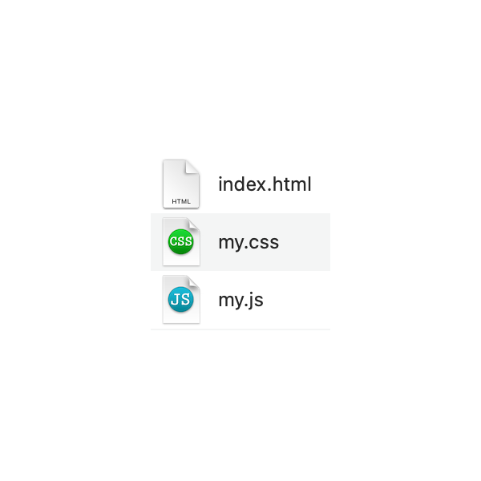
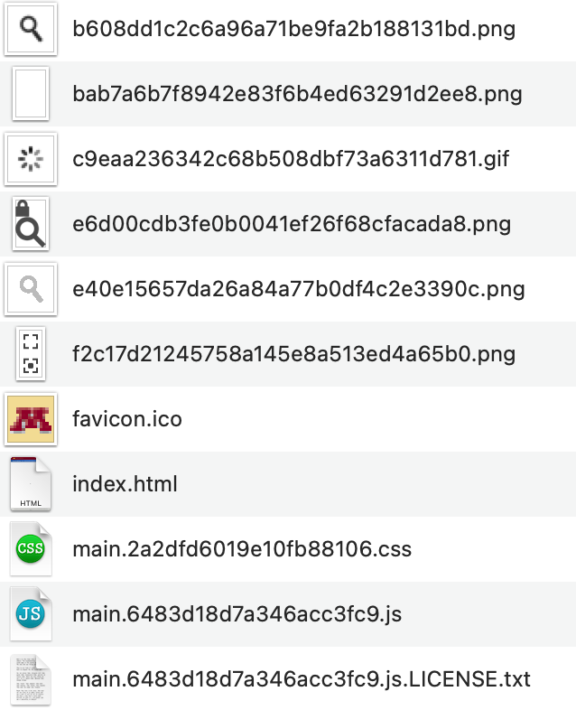
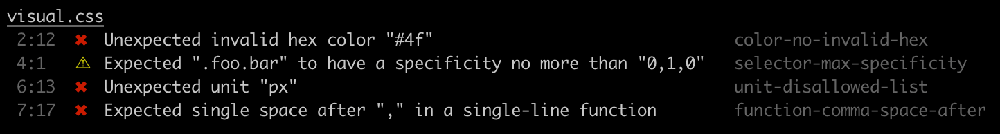
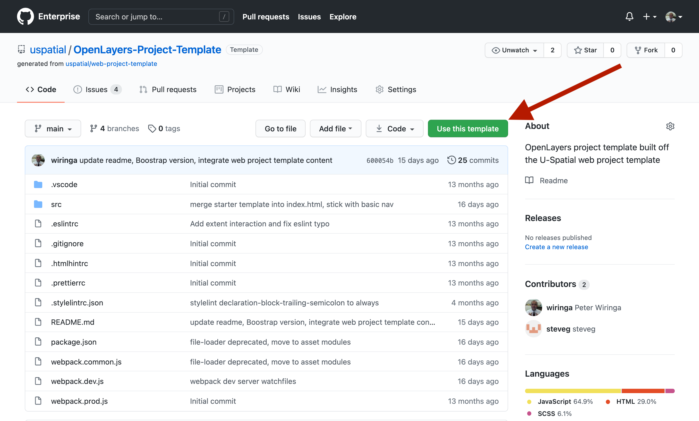
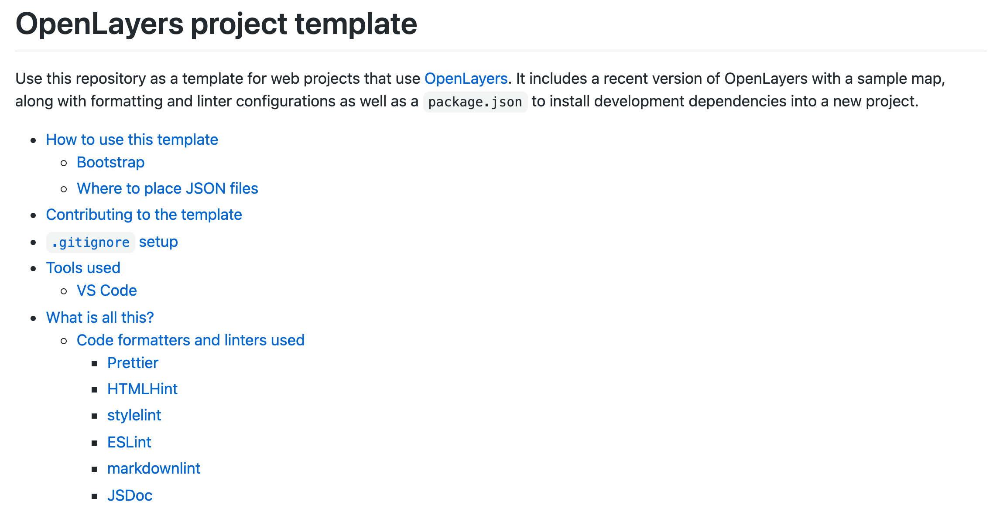

# Two Mixed Bags: Web Mapping Projects and Their Developers

Peter Wiringa (he/him)
Computing Geospatial Analyst ("GIS Developer" is fine)
U-Spatial, University of Minnesota
wiringa@umn.edu

---


## About U-Spatial

- Twin Cities and Duluth campuses
- 1.5 FTE regular employees in 2015, approximately 9 now
- Merged with UMD Geospatial Analysis Center (GAC) in 2019
- Heavy on students and recent students (+7)
- Team contributing to this project (current and former): Adam, Marylee, Pete, Steve, Zach

---


## It started with geodesign

- Multi-year transdisciplinary project, Seven-Mile Creek watershed, St. Peter, MN
- Tweak and refactor some, then move to rewrite
- "Do I rewrite this using _modern_ web development tools and techniques?"
- Short-term and long-term responsibilities

---

## What happened with geodesign?


- Long-term consideration for future staffing
- Go old-school, not modern
- Rewrote the app and it worked
- Code structure roughly the same, same nuisances as before

---




## Old ways

- One file to rule them all (`index.htm`)
  - JavaScript inline or in `script` blocks
  - Styles inline or in `style` blocks
- Less old, separate files for HTML, JavaScript, CSS (`index.html`, `my.js`, `my.css`)
- Monoliths and opaque boxes

---


## More web projects, changing staff

- Increasing demand for custom web GIS
- Increasing staff count
- Get everyone into source code management
- We need consistency across projects and within projects
  - Single-developer projects were the norm
  - Version control of inconsistently styled code? That problem has been solved
- Starting point: A template is born (2020)

---

## One template to support a lengthy objective

Provide U-Spatial staff, who may be new to web development, with a consistent starting point for web mapping projects that

- ensures some degree of consistency both within and across projects,
- enables cleaner collaboration,
- doesn't hinder more advanced projects,
- requires little effort to maintain, and
- isn't onerous.

---


## Questions to address

- What web mapping library?
- What frontend web framework?
- What tools?
- How to bring it all together?
- How do we keep it going?

---


## Some short answers

- Candidates: ArcGIS API for JavaScript, Leaflet, OpenLayers
  - OpenLayers selected in 2020
  - ArcGIS API for JavaScript option in progress in 2021
- Bootstrap selected as frontend framework (existing familiarity)
- GitHub Enterprise for source control management and issue tracking

---

## Tools and ways that aren't so new

- Sass (2006)
- JavaScript dependency management (~2010)
- Module bundlers (webpack, Parcel, Snowpack, Rollup, etc.)
- Hinters, linters
- Code formatters

---


## Syntactically Awesome Stylesheets (Sass)

- Compiles to CSS
- Supported variables, nesting, and more
- Good for compartmentalizing components
- Use the Sassy CSS (SCSS) syntax for Sass (`.scss` files)

---

## Sass to CSS example

```scss
/* Sass using SCSS syntax */
.legend {
  line-height: 18px;
  color: #555;

  h4 {
    font-size: 1rem;
  }
}
```

```css
/* CSS */
.legend { line-height: 18px; color: #555; }
.legend h4 { font-size: 1rem; }
```

---


## webpack as the module bundler

- Module bundlers handle JavaScript and other web material (HTML, CSS, images, etc.)
- The bundler creates a "bundle" all of your code and other assets, neatly packaged if well-configured
- A bundle might contain a single HTML file, a single CSS file, a single JS file, and a few images (this is different than the old way)
  - Many dependencies can be rolled up (e.g. OpenLayers+Bootstrap+...)
- Development server allows you to run locally and see updates almost immediately

---



## webpack example

- Configuration written in JavaScript
- At a high-level, use plugins and rules to define handling of JS, (S)CSS, images, and more to arrive at desired output (bundle)
- Shown here, the Minnesota LakeBrowser bundle (some images omitted)

---


## Yarn for JavaScript dependency management

- Alternative to `npm`
- Specify your JavaScript dependencies in `package.json` using `yarn add` command
- Run `yarn install` to install dependencies and their dependencies
- Define scripts/commands in `package.json` and run using `yarn`

---

## Abbreviated example of a `package.json`

_Many common fields and many `devDependencies` omitted for space_

```json
{
  "name": "UPDATE-ME-project-name-lowercase-and-hyphens-only",
  "scripts": {
    "test": "echo \"Error: no test specified\" && exit 1",
    "build": "webpack --config webpack.prod.js",
    "start": "webpack-dev-server --open --config webpack.dev.js"
  },
  "devDependencies": {
    "node-sass": "^6.0.1",
  },
  "dependencies": {
    "@popperjs/core": "^2.10.2",
    "bootstrap": "^5.1.3",
    "ol": "^6.9.0"
  }
}
```

---


## Prettier for code formatting

- Reformats your code, an "Opinionated Code Formatter" (their words)
- Opinions from professionals
- If something is reasonably readable and everything is consistent, isn't it good enough?

---

## `markdownlint`, a linter for markdown files

- Linters identify problems in your code and tell you about it
- Project `README.md` files, common in projects on GitHub, use one flavor of markdown
- These slides have been updated based on `markdownlint`

```markdown
## Yarn for JavaScript dependency management

- Alternative to `npm`
- Specify your JavaScript dependencies in `package.json` using `yarn add` command
- Run `yarn install` to install dependencies and their dependencies
- Define scripts/commands in `package.json` and run using `yarn`
```

---

## `markdownlint` examples

Some output while putting together this talk

```text
MD032/blanks-around-lists: Lists should be surrounded by blank lines
MD009/no-trailing-spaces: Trailing spaces [Expected: 0 or 2; Actual: 1]
MD012/no-multiple-blanks: Multiple consecutive blank lines [Expected: 1; Actual: 2]
```

---


## `eslint` for JavaScript linting

- What's a linter?
- Informs us what is not up to some standard or adherent to some style guide
- Set configuration to work with Prettier so they don't conflict!
- `eslint-plugin-jsdoc` to nag about code documentation

---

## Example `eslint` nags

Missing bits of function documentation

```text
Missing JSDoc @param "chartConfig" declaration.
Missing JSDoc @returns declaration.
```

Don't use the old `function doSomethingNifty()` way of defining functions

```text
Expected a function expression
```

A function that isn't used

```text
'doSomethingNifty' is defined but never used.
```

---

<!--  -->

## `stylelint` for (S)CSS linting



Example from [`stylelint` GitHub repository](https://github.com/stylelint/stylelint)


---


## Visual Studio Code

- We can use something else, but our template is built and tested using Visual Studio Code
- Support for linters and code formatters partially built-in, partially by extension
- Highly configurable
- Bonus: It's great for Python, too

---

## Roll it all into a GitHub template repository



---

## What is all this and how do I use it?



---

## How we've used it so far

- Slower tempo for new projects than expected at start of project
- Two geodesign apps
- Integrated elements with some existing projects
- Version for Esri ArcGIS for JavaScript API 4.x coming

---

## Maintaining the project template

- Update package minimum versions when initiating a new project
- Beneficial updates in downstream projects added back
- Communicate with the group using GitHub pull requests (review preferred), sometimes email

---


## Next steps

- Communicate
- Pre-commit hooks to enforce lint-free commits
- Select a frontend JavaScript framework
  - Angular
  - ~~React~~
  - Vue
- Alignment with [GitHub super-linter](https://github.com/github/super-linter)

---


## Thank you

Questions?
